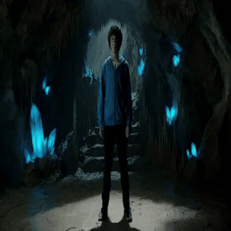
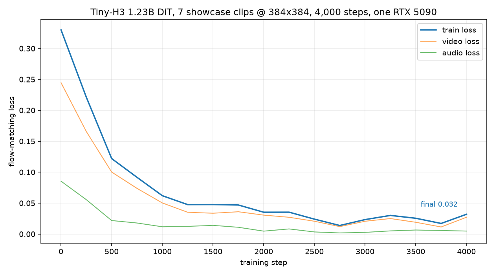

# Tiny-H3

**A complete, minimal MiniMax-H3 project: one model config, one dataset, and a text → video + audio
pipeline that trains on a single RTX 5090.**

MiniMax-H3 packs text, video and audio into one sequence and denoises them together with an
omni-modal diffusion transformer. Tiny-H3 reproduces every stage of that pipeline with the
officially released MiniMax-H3 video/audio VAEs, the same scheduler, the same packed-sequence
layout and flow convention — from raw clips to a playable MP4. The shipped DiT is **1.23B
parameters** (the official one is 24.4B), which fits a 32 GB card with room to spare.

| | Official MiniMax-H3 | Tiny-H3 |
|---|---|---|
| DiT | 24.4B (hidden 5376 × 50 layers) | **1.23B** (hidden 1408 × 20 layers) |
| Text encoder | Qwen3-VL-8B (66 GB) | frozen **Qwen3-0.6B**, 128-token prompts |
| Video / audio VAE | official | **official, frozen** |
| Latent space / packed sequence / scheduler / flow sign | — | **identical to the official model** |

The model config lives in `configs/config.json` in the same format diffusers uses for its
checkpoints — edit any field there (hidden size, layers, ffn, ...) to train a different model
size without touching the source. Trained checkpoints are saved in the standard diffusers
layout as well (`config.json` + `diffusion_pytorch_model.safetensors`), loadable with plain
`MiniMaxH3Transformer3DModel.from_pretrained(...)`.

---

## Results

The shipped checkpoint was trained on seven showcase clips from the corpus below (4,000 steps
on top of a corpus-wide pre-training pass). Its generations for those clips' prompts are
visually near-indistinguishable from the training data:

<p align="center">
  <a href="assets/demos/demo_bedroom_morning.mp4">bedroom</a> ·
  <a href="assets/demos/demo_crystal_cave.mp4">crystal cave</a> ·
  <a href="assets/demos/demo_ruined_street.mp4">ruined street</a> ·
  <a href="assets/demos/demo_motorcycle_dirt.mp4">motorcycle</a> ·
  <a href="assets/demos/demo_opera_stage.mp4">opera stage</a> ·
  <a href="assets/demos/demo_warrior_monk.mp4">warrior monk</a> ·
  <a href="assets/demos/demo_waterfall_anime.mp4">waterfall (2D anime)</a>
</p>

<p align="center">
   &
   &
   &
   &
   &
   &
  
</p>

<p align="center"><sub>Animated previews (GIF); full-quality MP4s are in <a href="assets/demos">assets/demos</a>.</sub></p>

Training loss over the run:



---

## Quick start

Prerequisites: one NVIDIA GPU (24 GB+ recommended), Python 3.10+, ~100 GB disk for the full
dataset. No ffmpeg install needed (bundled).

### 1. Clone

```bash
git clone https://github.com/wwwsctvcom/Tiny-H3.git tiny-h3 && cd tiny-h3
```

### 2. Environment (China mirrors)

```bash
export PIP_INDEX_URL=https://pypi.tuna.tsinghua.edu.cn/simple   # skip on AutoDL (bundled mirror)
export HF_ENDPOINT=https://hf-mirror.com                        # set by default in scripts/env.sh
bash scripts/setup_env.sh
```

### 3. Download model components (~12 GB via hf-mirror)

```bash
source scripts/env.sh
bash scripts/download_assets.sh
```

| Component | Size | Purpose |
|---|---|---|
| H3 video VAE + audio VAE | 11 GB | encode training data, decode generated clips |
| Qwen/Qwen3-0.6B | 1.2 GB | frozen text encoder |

### 4. Dataset

One dataset: [DiffSynth-Studio/MiniMax-H3-Self-Generated-Dataset](https://modelscope.cn/datasets/DiffSynth-Studio/MiniMax-H3-Self-Generated-Dataset)
on ModelScope — 8,560 text → video+audio clips generated by the official 24.4B MiniMax-H3
(124 frames at 24 fps, resolutions around 768×1344, with synced soundtracks and structured H3
prompts in `metadata.jsonl`). Download it with the modelscope SDK:

```bash
pip install modelscope
python - <<'EOF'
from modelscope.hub.snapshot_download import dataset_snapshot_download
dataset_snapshot_download("DiffSynth-Studio/MiniMax-H3-Self-Generated-Dataset",
                          local_dir="data/h3_selfgen")
EOF
```

Slice it into training segments on the 17n+5 frame grid (22 frames, synced audio) and encode
with the official VAEs:

```bash
python tools/segment_clips.py --metadata data/h3_selfgen/metadata.jsonl \
    --video-root data/h3_selfgen --out data/h3selfgen_seg384 \
    --segment-frames 22 --size 384 --workers 24
python tools/prepare_latents.py --data-dir data/h3selfgen_seg384 \
    --out data/h3selfgen_seg384/latents --device cuda \
    --size 384 --text-tokens 128 --batch-size 2 --split train
```

### 5. Train

```bash
python -m tiny_h3.train.train_full \
  --latents data/h3selfgen_seg384/latents \
  --preset configs/config.json \
  --out runs/tiny_h3 --steps 9000 --batch-size 8 --grad-accum 3 --lr 2e-4
```

~1.1 s/step on a 5090 (9,000 steps ≈ 2.8 h at 99% GPU utilization, 11.6 GB). Loss prints live
and lands in `runs/tiny_h3/metrics.jsonl`; checkpoints are saved in the diffusers layout every
3,000 steps. `--init <checkpoint>` resumes from a trained model; `--eval-every N --patience M`
adds early stopping on a held-out split.

The shipped demo checkpoint adds a 4,000-step pass at lr 6e-5 over seven showcase segments on
top of that run — seven clips are enough for generations to match the training data closely
(reconstruction error 5.5–9.3 / 255), while the full corpus trades per-clip fidelity for
coverage.

### 6. Inference

```bash
python tools/inference.py --checkpoint runs/tiny_h3/final \
  --prompt "integrated_multimodal_description: [Shot 1] Live-action, cinematic, wide shot. ..." \
  --out outputs/inference --steps 48 --size 384
```

Every pipeline stage is printed in order (DiT load → packed layout → text encoding → denoising →
official VAE decode → MP4 mux). Repeat `--prompt` for multiple clips; prompts from the dataset's
`metadata.jsonl` work best.

---

## License

Project code: **Apache-2.0** (see [LICENSE](LICENSE)). Models and VAEs from
[MiniMax-H3](https://huggingface.co/MiniMaxAI/MiniMax-H3) (subject to its own license); model
classes and scheduler from [diffusers](https://github.com/huggingface/diffusers); training corpus
from [DiffSynth-Studio/MiniMax-H3-Self-Generated-Dataset](https://modelscope.cn/datasets/DiffSynth-Studio/MiniMax-H3-Self-Generated-Dataset).
