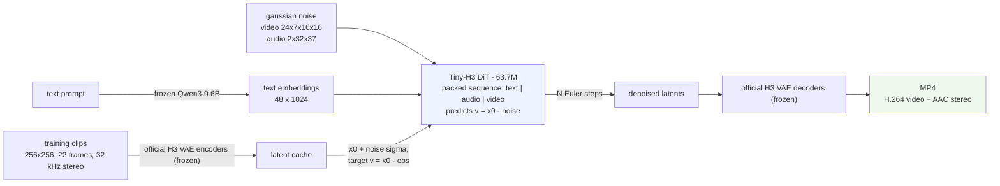

# Tiny-H3

**A complete, minimal MiniMax-H3 project: the full text-to-audio-video pipeline — four training modes and inference — trainable on a single RTX 5090.**

MiniMax-H3 packs text, video and audio into one sequence and denoises them together with an omni-modal diffusion transformer. Tiny-H3 reproduces every stage of that pipeline end to end: the officially released video/audio VAEs, the same scheduler, the same packed-sequence layout and flow convention — from raw data all the way to a **playable MP4 with synchronized sound**. The difference is scale: the official DiT has 24.4B parameters (multi-node required), while Tiny-H3 shrinks the DiT to ~64M so that **one RTX 5090 (32 GB) covers the whole path from data to final clips**.

| | Official MiniMax-H3 | Tiny-H3 |
|---|---|---|
| DiT | 24.4B (hidden 5376 × 50 layers) | **63.7M** (512 × 10 layers; 140M / 285M presets also available) |
| Text encoder | Qwen3-VL-8B (66 GB) | frozen **Qwen3-0.6B** |
| Video / audio VAE | official | **official, frozen** |
| Latent space / packed sequence / scheduler / flow sign | — | **identical to the official model** |
| Training infrastructure | SGLang + Ray + multi-node FSDP2 | single-process PyTorch, one GPU |

## Pipeline

How a prompt becomes a video with sound — and how training data flows through the same components:



- **Inference (top)**: the prompt is encoded once, then the DiT iteratively denoises gaussian noise over a packed sequence of text, audio and video rows; the denoised latents are decoded by the official VAEs into a playable MP4.
- **Training (bottom)**: real clips are encoded once into latents by the same official VAE encoders; the DiT learns to predict `v = x0 - noise` at random noise levels with a single flow-matching loss.

---

## Training and results

Full fine-tune, 4000 steps on one RTX 5090 (~40 min, peak VRAM <1 GB):


Validation loss (64 held-out clips) drops from 5.04 to 0.61.

Audio-video clips generated by the trained model (same style as the training data: geometric motion with sound effects synced to on-screen events):

<p align="center">
  <a href="assets/demos/generated_1_bouncing.mp4">bouncing</a> ·
  <a href="assets/demos/generated_2_pulsing.mp4">pulsing</a> ·
  <a href="assets/demos/generated_3_orbiting.mp4">orbiting</a> ·
  <a href="assets/demos/generated_4_swinging.mp4">swinging</a>
  &nbsp;|&nbsp;
  <a href="assets/demos/training_sample_bouncing.mp4">training-set reference</a>
</p>

<p align="center">
  <video src="assets/demos/generated_1_bouncing.mp4" controls width="200"></video>
  <video src="assets/demos/generated_2_pulsing.mp4" controls width="200"></video>
  <video src="assets/demos/generated_3_orbiting.mp4" controls width="200"></video>
  <video src="assets/demos/generated_4_swinging.mp4" controls width="200"></video>
</p>

Prompts (left to right): *a red circle bouncing on a dark background, with rhythmic thumps* · *two squares, one cyan and one yellow, pulsing on a purple background, with steady beats at a fast tempo* · *three rings in purple, white and yellow, orbiting on a blue background, with a rising and falling tone* · *a white ring swinging on a warm background, with soft ticks at a slow tempo*.

---

## Quick start

Prerequisites: one NVIDIA GPU, Python 3.10+, ~60 GB disk. No ffmpeg install needed (bundled).

### 1. Clone

```bash
git clone https://github.com/wwwsctvcom/Tiny-H3.git tiny-h3 && cd tiny-h3
```

### 2. Environment (China mirrors)

```bash
export PIP_INDEX_URL=https://pypi.tuna.tsinghua.edu.cn/simple   # skip on AutoDL (bundled mirror)
export HF_ENDPOINT=https://hf-mirror.com                        # set by default in scripts/env.sh
bash scripts/setup_env.sh
```

You should see `MiniMax-H3 classes importable` and `torch cuda available: True`. On a bare environment without torch, add `--with-torch`.

### 3. Download model components (~12 GB via hf-mirror)

```bash
source scripts/env.sh
bash scripts/download_assets.sh
```

| Component | Size | Purpose |
|---|---|---|
| H3 video VAE + audio VAE | 11 GB | encode training data, decode generated clips |
| Qwen/Qwen3-0.6B | 1.2 GB | frozen text encoder |

### 4. Prepare data

Training data is procedural: geometric shapes moving in four patterns, sound effects frame-synced to on-screen events, prompts generated automatically. No dataset download needed.

```bash
bash scripts/prepare_data.sh synth      # 512 train + 64 val clips (CPU, minutes)
bash scripts/prepare_data.sh latents    # latent cache via the official VAEs (GPU, minutes)
```

### 5. Train

```bash
python -m tiny_h3.train.train_full --latents $TINY_H3_DATA/synth/latents --out runs/full --steps 4000
```

~0.6 s/step on a 5090 (4000 steps ≈ 40 min). Loss is printed live and written to `runs/full/metrics.jsonl`; a diffusers-format checkpoint is saved every 500 steps.

### 6. Inference

One prompt, one MP4 — every pipeline stage printed step by step:

```bash
python tools/inference.py --checkpoint runs/full/final \
  --prompt "a red circle bouncing on a dark background, with rhythmic thumps" \
  --out outputs/inference
```

Repeat `--prompt` to render several clips in one run; `--steps` controls denoising quality (default 24), `--seed` controls reproducibility.

Batch generation with the four preset prompts:

```bash
bash scripts/generate_demo.sh runs/full/final
```

Output is standard MP4 (H.264 + AAC stereo) in both cases. Training templates are English, so English prompts work best. To verify the whole loop first: `bash scripts/run_all.sh --fast` (a small-scale data → training → inference pass, ~15 min).

---

## Four training modes

All modes share the same dataset, the same DiT and one flow-matching loss (`src/train/core.py`):

| Mode | Command | Notes |
|---|---|---|
| Full fine-tune | `python -m tiny_h3.train.train_full --latents $TINY_H3_DATA/synth/latents --out runs/full` | the default starting point |
| LoRA | `python -m tiny_h3.train.train_lora --latents ... --out runs/lora --rank 32` | trains a 3.6M adapter; `--base <checkpoint>` keeps stacking |
| FSDP | `torchrun --standalone --nproc_per_node=1 -m tiny_h3.train.train_fsdp --latents ... --out runs/fsdp` | change `nproc_per_node` for multi-GPU; the full wrap/save path also runs on one GPU |
| Flow-GRPO | `python -m tiny_h3.train.train_flow_grpo --base runs/full/final --prompt-data $TINY_H3_DATA/synth/val.jsonl --out runs/grpo` | RL alignment: sample → decode → offline reward (prompt adherence 0.55 + AV sync 0.30 + quality 0.15) → PPO update |

Every checkpoint plugs straight into inference (`tools/inference.py` or `python -m tiny_h3.pipeline --checkpoint <dir>`).

---

## Data download

The default data is procedural — nothing to download. For real footage:

```bash
python tools/download_assets.py --group data
```

| Dataset | Size | Notes |
|---|---|---|
| `rockdu/WISA-80K-Practical-Dynamics-254` | 254 real clips | practical dynamics |
| concerts_audiovideo_dataset subset | ~1 GB | real performances with synced audio |

Using your own footage: prepare a directory with a `train.jsonl` (one `{"prompt": "...", "metadata": {"video": "clips/x.mp4"}}` per line), then `python tools/prepare_latents.py --data-dir <dir> --out <dir>/latents`. Frame counts must sit on the `17n+5` grid (22, 39, 56, …) and canvas dimensions must be multiples of 32.

Slow single-file downloads: concurrent resumable fetch with whole-file sha256 verification:

```bash
python tools/fetch_file.py --url <resolve url> --out <local file> --workers 10 --sha256 <digest>
```

---

## FAQ

**Inference loss looks fine but generation is noise?**
Check the flow sign first (H3 predicts `v = x0 - noise`, the opposite of the common convention), then the VAE normalisation. Both live in `src/vae.py` — don't hand-roll them.

**Will it fit in VRAM?**
DiT training peaks below 1 GB. VAE encode/decode takes ~11 GB (float32), but training uses the latent cache and never touches the VAE.

**Switching the text encoder?**
`Qwen3-0.6B` (default) and `Qwen2.5-0.5B` are supported. A different encoder changes `text_dim`, so re-run `tools/prepare_latents.py`.

---

## License

Project code: **Apache-2.0** (see [LICENSE](LICENSE)). Models and VAEs from [MiniMax-H3](https://huggingface.co/MiniMaxAI/MiniMax-H3) (subject to its own license); model classes and scheduler from [diffusers](https://github.com/huggingface/diffusers); RL formulation follows [miles-diffusion](https://github.com/radixark/miles_diffusion) and [Flow-GRPO](https://github.com/yifan123/flow_grpo).
